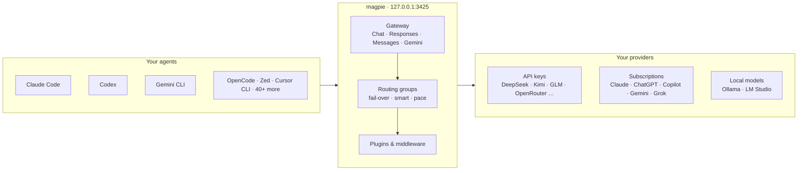

<div align="center">

<a href="https://usemagpie.ai"></a>

# magpie

### Every agent's model. One place.

**Claude Code on Kimi. Codex on DeepSeek. Gemini CLI on GLM. OpenCode on your ChatGPT plan.**<br>
Switch any of them from the menu bar. One local gateway serves them all,<br>
and when a quota runs out, it quietly moves on to the next account.

[](https://github.com/yetone/magpie-releases/releases/latest) [](https://github.com/yetone/magpie/stargazers) [](https://discord.gg/vGSnD3ZKQF) [](LICENSE)<br>
    

**[Download](https://usemagpie.ai)** &nbsp;·&nbsp; **[Docs](https://usemagpie.ai/docs/start)** &nbsp;·&nbsp; **[Reference](docs/reference.md)** &nbsp;·&nbsp; **[Plugins](https://github.com/magpie-community/plugins)** &nbsp;·&nbsp; **[Discord](https://discord.gg/vGSnD3ZKQF)** &nbsp;·&nbsp; **English** · [简体中文](README.zh-CN.md)

<br>

<picture>
  <source media="(prefers-color-scheme: dark)" srcset="site/public/img/agents-dark.png">
  
</picture>

<br>

<table>
<tr>
<td align="center" width="25%"><h3>45+</h3>agents, one list</td>
<td align="center" width="25%"><h3>4</h3>wire APIs, one gateway</td>
<td align="center" width="25%"><h3>5</h3>routing modes</td>
<td align="center" width="25%"><h3>0</h3>config files edited by hand</td>
</tr>
</table>

</div>

<br>

## Why magpie

You probably use more than one agent. Each keeps its model in its own file, in its own format, with its own keys and base URLs, and its own opinion about which vendors it supports. The subscription you pay for works in one agent and nowhere else. And when it runs dry at 3 pm, you're back to editing config files.

**magpie gathers all of it into one place.**

<table>
<tr>
<td width="33%" valign="top">

### 🎛 One screen
Every agent on your machine, in one list. Click a model, pick another. magpie changes exactly one key in the agent's own config. Comments, order and formatting stay untouched.

</td>
<td width="33%" valign="top">

### 🔌 One gateway
`127.0.0.1:3425` speaks OpenAI Chat, OpenAI Responses, Anthropic Messages and Gemini, and translates between them. Streaming, tool calls and reasoning included.

</td>
<td width="33%" valign="top">

### 🔀 Routing that keeps going
Group models from several providers. When one is rate-limited or out of quota, the next one answers. Your agent never sees the error.

</td>
</tr>
<tr>
<td valign="top">

### 🔑 Subscriptions, shared
Your Claude, ChatGPT, Copilot, Gemini or Grok sign-in becomes a provider that every other agent can use. No key to copy.

</td>
<td valign="top">

### 🧩 Plugins
OpenCode auth plugins and pi packages from npm run inside magpie. A plugin can also be gateway middleware that rewrites every request and reply.

</td>
<td valign="top">

### 📊 Every token, counted
Tokens, cache hits, cost at list price, balances and quota windows for every provider, account and session, with limits per key.

</td>
</tr>
</table>

<br>

## How it fits together



<br>

## Any model, any agent

Click a value and a searchable list opens: every model of every provider you added, as `provider/model`. Pick one and the agent's config is rewritten safely and atomically. Start a new session and the agent is on the new model.

**Profiles** save the setup of every agent under one name ("Budget", "Focus") and switch them all back in one move. Each agent can also have its own short list of models, so its picker shows only what you want there.

magpie lives where you are: a **menu bar** panel on macOS, Windows and Linux, a full **window**, a **TUI** (`magpie tui`), a **web UI** (`magpie web`, for WSL or a server over SSH) and a plain **CLI**.

<table>
<tr>
<td width="50%">
<picture>
  <source media="(prefers-color-scheme: dark)" srcset="site/public/img/panel-dark.png">
  
</picture>
</td>
<td width="50%">
<picture>
  <source media="(prefers-color-scheme: dark)" srcset="site/public/img/picker-dark.png">
  
</picture>
</td>
</tr>
</table>

## A provider is one field away

Pick a preset, paste a key, done. Model lists come straight from the vendor, with names and reasoning levels filled in from [models.dev](https://models.dev), so a model released this morning is in your picker on the next refresh. Nothing is compiled in.

> **Presets include** Anthropic · OpenAI · Google Gemini · DeepSeek · Kimi · Zhipu GLM · MiniMax · StepFun · Qwen · Baidu Qianfan · Tencent Cloud · Huawei Cloud MaaS · Volcengine Ark · Mistral · Groq · xAI · OpenRouter · Together · Fireworks · SiliconFlow · NVIDIA NIM · ModelScope · Ollama · LM Studio … and any OpenAI- or Anthropic-compatible URL.

<picture>
  <source media="(prefers-color-scheme: dark)" srcset="site/public/img/add-dark.png">
  
</picture>

Already set up elsewhere? **Import** brings in the providers from CC Switch, Claude Code, Codex and Alma. **[Add to magpie](https://usemagpie.ai/docs/import)** links let a provider's website hand its config to magpie in one click. Each key, like each account, can go through a proxy of its own.

## Routing that keeps going

A **routing group** is several models an agent picks as one, such as `group/daily-coding`. The gateway spreads requests over every member's keys and accounts:

| Mode | What it does |
| :-- | :-- |
| **`smart`** | Of the subscriptions with quota left, use the one that renews soonest, so less is wasted at the reset |
| **`order`** | Use the first model until it can't answer, then the next |
| **`rotate`** | Move to the next member on each turn |
| **`usage`** | Use the least-used member first |
| **`pace`** | Use the account with the most of its week left per hour until it resets |

Conversations **stay with the account that answered them** while the vendor's prompt cache is still worth keeping. **Intent routing** goes further: a small model of your choice reads each new turn, so tests go to the strong model and quick questions to the fast, cheap one. Groups can contain groups, and the Routing view shows every decision live.

<picture>
  <source media="(prefers-color-scheme: dark)" srcset="site/public/img/routing-dark.png">
  
</picture>

<table>
<tr>
<td width="50%">
<picture>
  <source media="(prefers-color-scheme: dark)" srcset="site/public/img/intent-trace-dark.png">
  
</picture>
</td>
<td width="50%">
<picture>
  <source media="(prefers-color-scheme: dark)" srcset="site/public/img/nested-routing-dark.png">
  
</picture>
</td>
</tr>
</table>

→ [Intent routing, in depth](https://usemagpie.ai/docs/intent)

## Sign in once, use it everywhere

An agent you're signed in to is a subscription with models behind it, so magpie offers it as a provider. Add several accounts per subscription and magpie fails over between them.

- **Claude**: drives the real local `claude` binary and bridges your agent's tools over MCP
- **Codex / ChatGPT**: your ChatGPT plan's models, in every other agent
- **GitHub Copilot**, **Gemini (Code Assist)**, **Antigravity**, **Grok (SuperGrok)** and more
- **Any OpenCode auth plugin or pi package** from npm

**Daily warm-up** starts each Claude and ChatGPT account's 5-hour window at the times of day you choose, or the moment the last one resets, so your windows line up with your day instead of with your first prompt.

## Plugins

```sh
magpie plugin add opencode-gemini-auth   # an OpenCode plugin from npm
magpie plugin add pi-antigravity         # a pi package, the same way
magpie plugin login google-plugin        # its own sign-in flow, in magpie
```

magpie runs plugins on [Bun](https://bun.sh), downloaded the first time a plugin needs it. A plugin signs in, lists its models and makes each request; agents use those models like any other provider's. Browse **[magpie-community/plugins](https://github.com/magpie-community/plugins)**, or [write your own](https://usemagpie.ai/docs/plugins).

A plugin can also be **gateway middleware**: JavaScript that sees what every agent sends and gets back, whatever the provider. `onRequest` can rewrite a request or turn it away, `onEvent` sees each streamed event, `onResponse` sees the whole reply. It runs in-process, about a microsecond per event, and a hook that throws or runs too long leaves the request as it was.

```js
// alias.middleware.js — magpie plugin add ./alias.middleware.js
export function onRequest(body, ctx) {
  if (body.model === "fast") return { ...body, model: "deepseek/deepseek-chat" };
}
```

<details>
<summary><b>Ready-made middleware</b>, most of it what <a href="https://github.com/QuantumNous/new-api">New API</a> does for its channels, with the same JSON</summary>

<br>

| Package | What it does |
| :-- | :-- |
| `param-override` | New API's `param_override`: set, delete, move or rewrite request fields, under conditions, or turn a request away |
| `model-map` | New API's `model_mapping`: send a model under another name; replies keep the name asked for |
| `system-prompt` | Your system prompt on every request, or some agents' or models' |
| `word-guard` | New API's sensitive-word filter: turn away or mask words in what users send, and in replies |
| `think-tags` | Take `<think>…</think>` out of replies, or put `reasoning_content` into them |

```sh
magpie plugin add @magpie-community/middleware-model-map
magpie plugin options model-map '{"mapping": {"fast": "deepseek/deepseek-chat"}}'
```

Find them under Plugins › Discover › Gateway middleware. See [Gateway middleware](https://usemagpie.ai/docs/plugins#middleware).

</details>

## Every token, counted

<picture>
  <source media="(prefers-color-scheme: dark)" srcset="site/public/img/usage-dark.png">
  
</picture>

- **Tokens, cache reads and writes, reasoning and calls**, with **cost at list price**, in dollars or yuan. Set your own price for any model.
- **Balances and quota windows** for every key, plan and subscription account (`magpie quota`). A **reset reminder** warns you before a window renews with much of it unused.
- **Sessions**: every agent conversation with its cost and title, reopened in your terminal with one click.
- **Context**: how full each request's context window is, how much came from the cache, and what fills it, part by part.
- **By account and by upstream key**, so you can check a vendor's bill line by line, and **OTLP export** to your own observability stack.

## Share one magpie

- **On your network.** Turn on *Share on local network* and give each client a named **gateway key**, each with its own daily, weekly or monthly token and cost limit.
- **Remote magpie.** A laptop can use the providers, accounts and routing groups of the magpie on your desktop, while still wiring its own agents.
- **Docker.** Run `ghcr.io/yetone/magpie` on a server or a NAS and manage it from the web UI.
- **Sync.** Back up to a file, or keep machines in sync over WebDAV (Nutstore, Nextcloud…) or S3.

## The little things

<table>
<tr>
<td width="50%" valign="top">

**📚 Library.** Write instructions, MCP servers and skills once; magpie writes them into each agent's files in that agent's format, and removes only what it wrote.

**🖼 Images and video.** Give any agent an image tool through MCP, made with the model you choose, and videos with a Grok subscription.

**☕ Keep awake.** Your computer doesn't go to sleep in the middle of an agent's task.

</td>
<td width="50%" valign="top">

**⬆️ Install and update agents.** The Agents page shows each CLI's version, updates it the way it was installed, and gives the commands to install the ones you don't have yet.

**🐧 WSL.** On Windows, agents inside WSL distros are wired too, and their sessions counted.

**🎨 At home on your desktop.** Light and dark, and on [Omarchy](https://omarchy.org) magpie takes your theme's look.

</td>
</tr>
</table>

## Supported agents

<table>
<tr><td>

Claude Code · Claude Desktop · Codex · Gemini CLI · Antigravity CLI · OpenCode · OpenChamber · MiMo Code · Pi · oh-my-pi · Aside · OmO · Goose · Cursor CLI · Cursor Private Inference · Zed · VS Code Chat · VS Code Insiders · VSCodium Chat · JetBrains Air · Copilot (JetBrains) · Copilot CLI · Crush · DeepSeek Harness · Reasonix Studio · Command Code · fx · Devin · Hermes Agent · Mister Morph · Kimi Code · Qwen Code · Muse Code · Empryo · MiniMax Code · Droid · Cline · Qoder · Qoder CN · Grok Build · ZCode · WorkBuddy · CodeBuddy Code · Pencil · T3 Code · OpenHanako · AtomCode · Alma · Cindy

</td></tr>
</table>

magpie shows only the agents installed on your machine; setup notes for some of them are in the [reference](docs/reference.md#notes-on-some-agents). Anything else that takes a base URL can use the gateway too:

```sh
export OPENAI_BASE_URL=http://127.0.0.1:3425/v1     OPENAI_API_KEY=magpie
export ANTHROPIC_BASE_URL=http://127.0.0.1:3425     ANTHROPIC_API_KEY=magpie
export GOOGLE_GEMINI_BASE_URL=http://127.0.0.1:3425 GEMINI_API_KEY=magpie
```

## Quick start

**1 · Install.** Download the app from **[usemagpie.ai](https://usemagpie.ai)**, or run:

```sh
curl -fsSL https://usemagpie.ai/install.sh | sh
```

<sub>Mac builds are signed and notarised, and every build updates itself. Behind a firewall, use `--proxy` or `--mirror`. Or `go install github.com/yetone/magpie@latest`, or the [Docker image](docs/reference.md#docker).</sub>

**2 · Add a provider.** Open magpie and go to **Providers → Add provider**. Pick a preset, or sign in with a subscription.

**3 · Pick a model** for each agent on the **Agents** page. Start a new session and it's on the new model.

Or do it all from the terminal:

```sh
magpie provider add deepseek sk-…              # a preset needs only the key
magpie claude deepseek/deepseek-v4-pro          # Claude Code on DeepSeek
magpie codex moonshot/kimi-k2.5                 # Codex on Kimi
magpie group add "Opus anywhere" models=claude/claude-opus-5-5,copilot/claude-opus-5.5 routing=smart
magpie claude group/opus-anywhere               # fails over between subscriptions
magpie save work && magpie use work             # profiles
magpie quota                                    # what's left on every plan
magpie tui                                      # the whole thing, in a terminal
```

## Documentation

| | |
| :-- | :-- |
| **[Get started](https://usemagpie.ai/docs/start)** | The guided tour |
| **[Reference](docs/reference.md)** | Every agent, provider option, gateway endpoint, CLI command and file |
| **[Plugins](https://usemagpie.ai/docs/plugins)** | Use plugins and write your own |
| **[Intent routing](https://usemagpie.ai/docs/intent)** | Route each turn by what it asks for |
| **[Import links](https://usemagpie.ai/docs/import)** | "Add to magpie" buttons for provider websites |

## Community

Questions, ideas, or a model that won't show up? Join us on **[Discord](https://discord.gg/vGSnD3ZKQF)** or [open an issue](https://github.com/yetone/magpie/issues).

If magpie saved you from editing one more config file, **a ⭐ helps others find it.**

<a href="https://star-history.com/#yetone/magpie&Date">
  <picture>
    <source media="(prefers-color-scheme: dark)" srcset="https://api.star-history.com/svg?repos=yetone/magpie&type=Date&theme=dark">
    
  </picture>
</a>

## License

[MIT](LICENSE)
