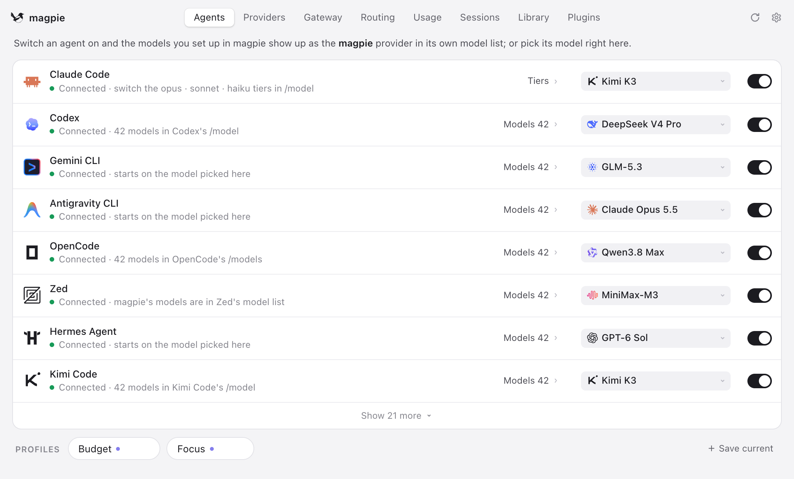
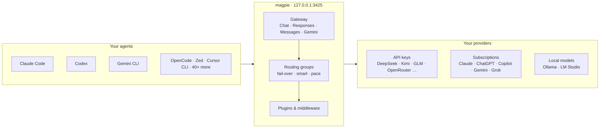

<div align="center">

<a href="https://usemagpie.ai"></a>

# magpie

### Every agent's model. One place.

**Claude Code on Kimi. Codex on DeepSeek. Gemini CLI on GLM. OpenCode on your ChatGPT plan.**<br>
Switch any of them from the menu bar. One local gateway serves them all,<br>
and when a quota runs out, it quietly moves on to the next account.

[](https://github.com/yetone/magpie-releases/releases/latest) [](https://github.com/yetone/magpie/stargazers) [](https://discord.gg/vGSnD3ZKQF) [](LICENSE)<br>
    

**[Download](https://usemagpie.ai)** &nbsp;·&nbsp; **[Docs](https://usemagpie.ai/docs/start)** &nbsp;·&nbsp; **[Reference](docs/reference.md)** &nbsp;·&nbsp; **[Plugins](https://github.com/magpie-community/plugins)** &nbsp;·&nbsp; **[Discord](https://discord.gg/vGSnD3ZKQF)** &nbsp;·&nbsp; **English** · [简体中文](README.zh-CN.md)

<br>

<picture>
  <source media="(prefers-color-scheme: dark)" srcset="site/public/img/agents-dark.png">
  
</picture>

<br>

<table>
<tr>
<td align="center" width="25%"><h3>45+</h3>agents, one list</td>
<td align="center" width="25%"><h3>4</h3>wire APIs, one gateway</td>
<td align="center" width="25%"><h3>5</h3>routing modes</td>
<td align="center" width="25%"><h3>0</h3>config files edited by hand</td>
</tr>
</table>

</div>

<br>

## Is magpie for you?

Each agent keeps its model in its own file, in its own format, with its own keys and base URLs. A subscription you pay for works in one agent and nowhere else. magpie puts all of that behind one app and one local gateway:

- **Pick any model for any agent** from one list. magpie edits the one key that matters in the agent's own config.
- **Use one provider everywhere**: an API key, a local model, or the Claude, ChatGPT, Copilot, Gemini or Grok plan you're signed in to.
- **Keep going when a quota runs out**: a routing group moves to the next account or model, and the agent never sees the error.

It's for you if you use more than one agent, more than one provider, or more than one account. If you use one agent on its vendor's own plan and that's enough, you don't need it.

Runs on macOS, Windows and Linux (menu bar app, window, TUI, web UI and CLI), in Docker, and on Termux.

## Quick start

**1 · Install.** Download the app from **[usemagpie.ai](https://usemagpie.ai)**, or run:

```sh
curl -fsSL https://usemagpie.ai/install.sh | sh
```

<sub>Mac builds are signed and notarised, and every build updates itself. Behind a firewall, use `--proxy` or `--mirror`. Or `go install github.com/yetone/magpie@latest`, or the [Docker image](docs/reference.md#docker).</sub>

**2 · Add a provider.** Open magpie and go to **Providers → Add provider**. Pick a preset and paste a key, or sign in with a subscription.

**3 · Pick a model** for each agent on the **Agents** page. Start a new session and it's on the new model.

Or do it all from the terminal:

```sh
magpie provider add deepseek sk-…              # a preset needs only the key
magpie claude deepseek/deepseek-v4-pro          # Claude Code on DeepSeek
magpie codex moonshot/kimi-k2.5                 # Codex on Kimi
magpie group add "Opus anywhere" models=claude/claude-opus-5-5,copilot/claude-opus-5.5 routing=smart
magpie claude group/opus-anywhere               # fails over between subscriptions
magpie save work && magpie use work             # profiles
magpie quota                                    # what's left on every plan
magpie tui                                      # the whole thing, in a terminal
```

## Supported agents

<table>
<tr><td>

Claude Code · Claude Desktop · Codex · Gemini CLI · Antigravity CLI · OpenCode · OpenChamber · MiMo Code · Pi · oh-my-pi · Aside · OmO · Goose · Cursor CLI · Cursor Private Inference · Zed · VS Code Chat · VS Code Insiders · VSCodium Chat · JetBrains Air · Copilot (JetBrains) · Copilot CLI · Crush · DeepSeek Harness · Reasonix Studio · Command Code · fx · Devin · Hermes Agent · Mister Morph · Kimi Code · Qwen Code · Muse Code · Empryo · MiniMax Code · Droid · Cline · Qoder · Qoder CN · Grok Build · ZCode · WorkBuddy · CodeBuddy Code · Pencil · T3 Code · OpenHanako · AtomCode · Alma · Cindy

</td></tr>
</table>

magpie shows only the agents installed on your machine; setup notes for some of them are in the [reference](docs/reference.md#notes-on-some-agents). Anything else that takes a base URL can use the gateway too:

```sh
export OPENAI_BASE_URL=http://127.0.0.1:3425/v1     OPENAI_API_KEY=magpie
export ANTHROPIC_BASE_URL=http://127.0.0.1:3425     ANTHROPIC_API_KEY=magpie
export GOOGLE_GEMINI_BASE_URL=http://127.0.0.1:3425 GEMINI_API_KEY=magpie
```

## How it fits together

The gateway at `127.0.0.1:3425` speaks OpenAI Chat, OpenAI Responses, Anthropic Messages and Gemini, and translates between them, streaming, tool calls and reasoning included.




## What it does

### Any model, any agent

Click a value and a searchable list opens: every model of every provider you added, as `provider/model`. The agent's config is rewritten atomically, and its comments, order and formatting stay as they were. **Profiles** save every agent's setup under one name ("Budget", "Focus") and switch them all back in one move. Each agent can also have its own short list of models; a profile keeps that list too.

<table>
<tr>
<td width="50%">
<picture>
  <source media="(prefers-color-scheme: dark)" srcset="site/public/img/panel-dark.png">
  
</picture>
</td>
<td width="50%">
<picture>
  <source media="(prefers-color-scheme: dark)" srcset="site/public/img/picker-dark.png">
  
</picture>
</td>
</tr>
</table>

### Providers

Pick a preset, paste a key. Model lists come from the vendor, with names and reasoning levels filled in from [models.dev](https://models.dev), so a model released this morning is in your picker on the next refresh.

> **Presets include** Anthropic · OpenAI · Google Gemini · DeepSeek · Kimi · Zhipu GLM · MiniMax · StepFun · Qwen · Baidu Qianfan · Tencent Cloud · Huawei Cloud MaaS · Volcengine Ark · Mistral · Groq · xAI · OpenRouter · Together · Fireworks · SiliconFlow · NVIDIA NIM · ModelScope · Ollama · LM Studio … and any OpenAI- or Anthropic-compatible URL.

**Import** brings in the providers from CC Switch, Claude Code, Codex and Alma. **[Add to magpie](https://usemagpie.ai/docs/import)** links let a provider's website hand its config to magpie in one click. Each key and each account can go through a proxy of its own.

<picture>
  <source media="(prefers-color-scheme: dark)" srcset="site/public/img/add-dark.png">
  
</picture>

### Subscriptions

An agent you're signed in to is a subscription with models behind it, so magpie offers it as a provider to every other agent. Add several accounts per subscription and magpie fails over between them.

- **Claude**: drives the real local `claude` binary and bridges your agent's tools over MCP
- **Codex / ChatGPT**: your ChatGPT plan's models, in every other agent
- **GitHub Copilot**, **Gemini (Code Assist)**, **Antigravity**, **Grok (SuperGrok)** and more
- **Any OpenCode auth plugin or pi package** from npm

**Daily warm-up** starts each Claude and ChatGPT account's 5-hour window at the times you choose, or the moment the last one resets.

### Routing groups

A **routing group** is several models an agent picks as one, such as `group/daily-coding`. The gateway spreads requests over every member's keys and accounts:

| Mode | What it does |
| :-- | :-- |
| **`smart`** | Of the subscriptions with quota left, use the one that renews soonest, so less is wasted at the reset |
| **`order`** | Use the first model until it can't answer, then the next |
| **`rotate`** | Move to the next member on each turn |
| **`usage`** | Use the least-used member first |
| **`pace`** | Use the account with the most of its week left per hour until it resets |

A conversation **stays with the account that answered it** while the vendor's prompt cache is worth keeping. Groups can contain groups. **[Intent routing](https://usemagpie.ai/docs/intent)** has a small model of your choice read each new turn, so tests go to the strong model and quick questions to the cheap one. The Routing view shows every decision live.

<picture>
  <source media="(prefers-color-scheme: dark)" srcset="site/public/img/routing-dark.png">
  
</picture>

### Plugins

```sh
magpie plugin add opencode-gemini-auth   # an OpenCode plugin from npm
magpie plugin add pi-antigravity         # a pi package, the same way
magpie plugin login google-plugin        # its own sign-in flow, in magpie
```

Plugins run on [Bun](https://bun.sh), downloaded the first time one needs it. A plugin signs in, lists its models and makes each request; agents use those models like any other provider's. Browse **[magpie-community/plugins](https://github.com/magpie-community/plugins)**, or [write your own](https://usemagpie.ai/docs/plugins).

A plugin can also be **gateway middleware**: JavaScript that sees what every agent sends and gets back. `onRequest` can rewrite a request or turn it away, `onEvent` sees each streamed event, `onResponse` the whole reply. A hook that throws or runs too long leaves the request as it was.

```js
// alias.middleware.js — magpie plugin add ./alias.middleware.js
export function onRequest(body, ctx) {
  if (body.model === "fast") return { ...body, model: "deepseek/deepseek-chat" };
}
```

<details>
<summary><b>Ready-made middleware</b>, most of it what <a href="https://github.com/QuantumNous/new-api">New API</a> does for its channels, with the same JSON</summary>

<br>

| Package | What it does |
| :-- | :-- |
| `param-override` | New API's `param_override`: set, delete, move or rewrite request fields, under conditions, or turn a request away |
| `model-map` | New API's `model_mapping`: send a model under another name; replies keep the name asked for |
| `system-prompt` | Your system prompt on every request, or some agents' or models' |
| `word-guard` | New API's sensitive-word filter: turn away or mask words in what users send, and in replies |
| `think-tags` | Take `<think>…</think>` out of replies, or put `reasoning_content` into them |

```sh
magpie plugin add @magpie-community/middleware-model-map
magpie plugin options model-map '{"mapping": {"fast": "deepseek/deepseek-chat"}}'
```

Find them under Plugins › Discover › Gateway middleware. See [Gateway middleware](https://usemagpie.ai/docs/plugins#middleware).

</details>

### Usage and cost

<picture>
  <source media="(prefers-color-scheme: dark)" srcset="site/public/img/usage-dark.png">
  
</picture>

| | |
| :-- | :-- |
| **Tokens and cost** | Tokens, cache reads and writes, reasoning and calls, with cost at list price in dollars or yuan; set your own price for any model |
| **Quota** | Balances and quota windows for every key, plan and account (`magpie quota`), and a reminder before a window renews with much of it unused |
| **Sessions** | Every agent conversation with its cost and title, reopened in your terminal with one click |
| **Context** | How full each request's context window is, how much came from the cache, and what fills it |
| **Bills** | By account and by upstream key, and OTLP export to your own observability stack |

### Sharing

| | |
| :-- | :-- |
| **Local network** | Turn on *Share on local network* and give each client a named gateway key with its own daily, weekly or monthly token and cost limit |
| **Remote magpie** | A laptop uses the providers, accounts and groups of the magpie on your desktop, and still wires its own agents |
| **Docker** | Run `ghcr.io/yetone/magpie` on a server or a NAS and manage it from the web UI |
| **Sync** | Back up to a file, or sync machines over WebDAV (Nutstore, Nextcloud…), S3, or an encrypted GitHub repository backup |

### Also

- **Library**: write instructions, MCP servers and skills once; magpie writes them into each agent's files in its format, and removes only what it wrote.
- **Images and video**: an image tool for any agent over MCP, with the model you choose, and videos with a Grok subscription.
- **Agents kept current**: the Agents page shows each CLI's version, updates it the way it was installed, and gives the commands for the ones you don't have.
- **WSL**: on Windows, agents inside WSL distros are wired too, and their sessions counted.
- **Keep awake**, light and dark, and your theme's look on [Omarchy](https://omarchy.org).

## Documentation

| | |
| :-- | :-- |
| **[Get started](https://usemagpie.ai/docs/start)** | The guided tour |
| **[Reference](docs/reference.md)** | Every agent, provider option, gateway endpoint, CLI command and file |
| **[Plugins](https://usemagpie.ai/docs/plugins)** | Use plugins and write your own |
| **[Intent routing](https://usemagpie.ai/docs/intent)** | Route each turn by what it asks for |
| **[Import links](https://usemagpie.ai/docs/import)** | "Add to magpie" buttons for provider websites |

## Privacy

Your prompts, replies, keys and accounts go only to the providers you use. Once a day a released magpie tells us it is in use: a random id, its version and system, and which agents, providers and models it is used with, by magpie's own ids (a provider you added yourself is only `custom`), and for each partner listed first in the add sheet, how many times a day it was shown, opened and added (counts only). No names, URLs, accounts, keys, prompts or usage. Turn part or all of it off in **Settings → Privacy**, or with `DO_NOT_TRACK=1`. [What is sent, exactly](docs/reference.md#counting-users).

## Community

Questions, ideas, or a model that won't show up? Tell us on **[Discord](https://discord.gg/vGSnD3ZKQF)**. That is where feedback goes.

**This repository doesn't take pull requests.** Only maintainers can open them. If you'd like a fix or a feature, describe it on Discord and we'll build it.

If magpie saved you from editing one more config file, **a ⭐ helps others find it.**

<a href="https://star-history.com/#yetone/magpie&Date">
  <picture>
    <source media="(prefers-color-scheme: dark)" srcset="https://api.star-history.com/svg?repos=yetone/magpie&type=Date&theme=dark">
    
  </picture>
</a>

## License

[MIT](LICENSE)
