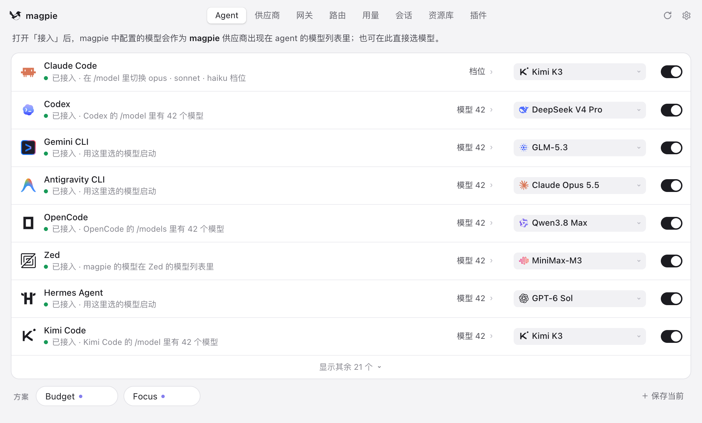
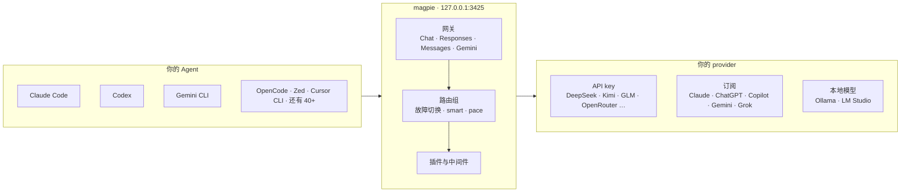

<div align="center">

<a href="https://usemagpie.ai/zh/"></a>

# magpie

### 所有 Agent 的模型，一处搞定。

**Claude Code 跑 Kimi，Codex 跑 DeepSeek，Gemini CLI 跑 GLM，OpenCode 用你的 ChatGPT 订阅。**<br>
在菜单栏一点就能切换。所有 Agent 共用一个本地网关，<br>
额度用完时，它会悄悄切到下一个账号。

[](https://github.com/yetone/magpie-releases/releases/latest) [](https://github.com/yetone/magpie/stargazers) [](https://discord.gg/vGSnD3ZKQF) [](LICENSE)<br>
    

**[下载](https://usemagpie.ai/zh/)** &nbsp;·&nbsp; **[文档](https://usemagpie.ai/docs/zh/start)** &nbsp;·&nbsp; **[完整参考（英文）](docs/reference.md)** &nbsp;·&nbsp; **[插件](https://github.com/magpie-community/plugins)** &nbsp;·&nbsp; **[Discord](https://discord.gg/vGSnD3ZKQF)** &nbsp;·&nbsp; [English](README.md) · **简体中文**

<br>

<picture>
  <source media="(prefers-color-scheme: dark)" srcset="site/public/img/agents-zh-dark.png">
  
</picture>

<br>

<table>
<tr>
<td align="center" width="25%"><h3>45+</h3>个 Agent，一张表</td>
<td align="center" width="25%"><h3>4</h3>种接口协议，一个网关</td>
<td align="center" width="25%"><h3>5</h3>种路由模式</td>
<td align="center" width="25%"><h3>0</h3>个需要手改的配置文件</td>
</tr>
</table>

</div>

<br>

## 为什么需要 magpie

你大概不止用一个 Agent。每个 Agent 都把模型写在自己的配置文件里，格式各不相同，key 和 base URL 各管各的，支持哪些厂商也是它自己说了算。你花钱买的订阅只能在一个 Agent 里用。下午三点额度用完，你又得开始手改配置文件。

**magpie 把这些都收到一处。**

<table>
<tr>
<td width="33%" valign="top">

### 🎛 一个界面
电脑上的所有 Agent 列在一张表里。点一下模型，换成别的。magpie 只改 Agent 配置里的那一个键，注释、顺序和格式原样保留。

</td>
<td width="33%" valign="top">

### 🔌 一个网关
`127.0.0.1:3425` 同时支持 OpenAI Chat、OpenAI Responses、Anthropic Messages 和 Gemini，并在它们之间互相转换。流式输出、工具调用和推理全都支持。

</td>
<td width="33%" valign="top">

### 🔀 不断线的路由
把多个 provider 的模型编成一组。一个被限流或额度用完，下一个立刻接上，Agent 根本看不到报错。

</td>
</tr>
<tr>
<td valign="top">

### 🔑 订阅共享
你登录的 Claude、ChatGPT、Copilot、Gemini 或 Grok 会变成一个 provider，其他所有 Agent 都能用，不用复制任何 key。

</td>
<td valign="top">

### 🧩 插件
npm 上的 OpenCode 登录插件和 pi 包可以直接在 magpie 里跑。插件还能当网关中间件，改写每一个请求和回复。

</td>
<td valign="top">

### 📊 每个 token 都有账
每个 provider、账号和会话的 token、缓存命中、按官方价格算的花费、余额和额度窗口，还能给每个 key 设上限。

</td>
</tr>
</table>

<br>

## 整体结构



<br>

## 任意模型，任意 Agent

点一下模型，弹出可搜索的列表：你添加的每个 provider 的每个模型，格式是 `provider/model`。选中后，magpie 安全、原子地改写 Agent 的配置。开一个新会话，Agent 就用上新模型了。

**方案（Profile）**把所有 Agent 的配置存成一个名字，比如「省钱」「专注」，一键全部切回去。每个 Agent 还可以有自己的常用模型短名单，选择器里只显示你想要的。

magpie 在你需要的地方：macOS、Windows 和 Linux 的**菜单栏**面板、完整的**窗口**、**TUI**（`magpie tui`）、**Web 界面**（`magpie web`，适合 WSL 或通过 SSH 管服务器）和纯 **CLI**。

<table>
<tr>
<td width="50%">
<picture>
  <source media="(prefers-color-scheme: dark)" srcset="site/public/img/panel-dark.png">
  
</picture>
</td>
<td width="50%">
<picture>
  <source media="(prefers-color-scheme: dark)" srcset="site/public/img/picker-dark.png">
  
</picture>
</td>
</tr>
</table>

## 加一个 provider，只要填一个框

选一个预设，粘贴 key，完事。模型列表直接来自厂商，名称和推理档位从 [models.dev](https://models.dev) 补全，所以今天早上刚发布的模型，下次刷新就出现在你的选择器里。magpie 里没有写死任何模型列表。

> **预设包括** Anthropic · OpenAI · Google Gemini · DeepSeek · Kimi · 智谱 GLM · MiniMax · 阶跃星辰 · 通义千问 · 百度千帆 · 腾讯云 · 华为云 MaaS · 火山方舟 · Mistral · Groq · xAI · OpenRouter · Together · Fireworks · 硅基流动 · NVIDIA NIM · 魔搭 · Ollama · LM Studio …… 以及任何兼容 OpenAI 或 Anthropic 的地址。

<picture>
  <source media="(prefers-color-scheme: dark)" srcset="site/public/img/add-zh-dark.png">
  
</picture>

已经在别处配好了？**导入**能读取你在 CC Switch、Claude Code、Codex 和 Alma 里配置的 provider。**[「添加到 magpie」链接](https://usemagpie.ai/docs/zh/import)**让 provider 网站一键把配置交给 magpie。每个 key 和每个账号一样，都可以走自己的代理。

## 不断线的路由

**路由组**是 Agent 当作一个模型来选的一组模型，比如 `group/daily-coding`。网关会把请求分摊到每个成员的 key 和账号上：

| 模式 | 作用 |
| :-- | :-- |
| **`smart`** | 在还有额度的订阅里，优先用最快重置的那个，重置时浪费得最少 |
| **`order`** | 先用第一个模型，它答不了再用下一个 |
| **`rotate`** | 每一轮换下一个成员 |
| **`usage`** | 优先用用得最少的成员 |
| **`pace`** | 优先用距离重置前每小时剩余周额度最多的账号 |

只要厂商的提示词缓存还值得保留，**对话就会留在回答它的那个账号上**。**意图路由**更进一步：由你选的一个小模型读每一轮新消息，写测试交给强模型，简单问题交给又快又便宜的模型。路由组可以嵌套，路由页实时展示每一次决策。

<picture>
  <source media="(prefers-color-scheme: dark)" srcset="site/public/img/routing-zh-dark.png">
  
</picture>

<table>
<tr>
<td width="50%">
<picture>
  <source media="(prefers-color-scheme: dark)" srcset="site/public/img/intent-trace-zh-dark.png">
  
</picture>
</td>
<td width="50%">
<picture>
  <source media="(prefers-color-scheme: dark)" srcset="site/public/img/nested-routing-zh-dark.png">
  
</picture>
</td>
</tr>
</table>

→ [意图路由详解](https://usemagpie.ai/docs/zh/intent)

## 登录一次，处处可用

你登录过的 Agent 背后就是一个带模型的订阅，magpie 把它当成 provider 提供出来。每个订阅可以加多个账号，magpie 会在它们之间自动切换。

- **Claude**：驱动本机真正的 `claude` 程序，通过 MCP 桥接你的 Agent 的工具
- **Codex / ChatGPT**：你的 ChatGPT 订阅里的模型，给所有其他 Agent 用
- **GitHub Copilot**、**Gemini（Code Assist）**、**Antigravity**、**Grok（SuperGrok）** 等等
- **任何 OpenCode 登录插件或 pi 包**，直接从 npm 安装

**每日预热**会在你选定的时间，或者上一个窗口刚重置时，启动每个 Claude 和 ChatGPT 账号的 5 小时窗口，让窗口跟着你的作息走，而不是跟着你的第一条消息走。

## 插件

```sh
magpie plugin add opencode-gemini-auth   # npm 上的 OpenCode 插件
magpie plugin add pi-antigravity         # pi 包，同样的方式
magpie plugin login google-plugin        # 在 magpie 里走它自己的登录流程
```

插件运行在 [Bun](https://bun.sh) 上，第一次需要时自动下载。插件负责登录、列出模型和发送请求，Agent 像用其他 provider 一样用它的模型。去 **[magpie-community/plugins](https://github.com/magpie-community/plugins)** 逛逛，或者[自己写一个](https://usemagpie.ai/docs/zh/plugins)。

插件还可以是**网关中间件**：一段 JavaScript，能看到每个 Agent 发出和收到的内容，不管走哪个 provider。`onRequest` 可以改写或拒绝请求，`onEvent` 看到每个流式事件，`onResponse` 看到完整回复。它在进程内运行，每个事件约一微秒；钩子抛错或超时，请求原样放行。

```js
// alias.middleware.js — magpie plugin add ./alias.middleware.js
export function onRequest(body, ctx) {
  if (body.model === "fast") return { ...body, model: "deepseek/deepseek-chat" };
}
```

<details>
<summary><b>现成的中间件</b>，大多对应 <a href="https://github.com/QuantumNous/new-api">New API</a> 给渠道做的事，JSON 格式也一样</summary>

<br>

| 包 | 作用 |
| :-- | :-- |
| `param-override` | New API 的 `param_override`：按条件设置、删除、移动或改写请求字段，或拒绝请求 |
| `model-map` | New API 的 `model_mapping`：把模型换个名字发出去，回复里仍是原来请求的名字 |
| `system-prompt` | 给所有请求，或某些 Agent、某些模型的请求加上你的系统提示词 |
| `word-guard` | New API 的敏感词过滤：在用户发送的内容和回复里拒绝或屏蔽敏感词 |
| `think-tags` | 去掉回复里的 `<think>…</think>`，或把 `reasoning_content` 放进回复 |

```sh
magpie plugin add @magpie-community/middleware-model-map
magpie plugin options model-map '{"mapping": {"fast": "deepseek/deepseek-chat"}}'
```

在「插件 › 发现 › 网关中间件」里可以找到它们。详见[网关中间件](https://usemagpie.ai/docs/zh/plugins#middleware)。

</details>

## 每个 token 都有账

<picture>
  <source media="(prefers-color-scheme: dark)" srcset="site/public/img/usage-zh-dark.png">
  
</picture>

- **token、缓存读写、推理和调用次数**，以及**按官方价格算的花费**，美元或人民币都行。任何模型都能自定义价格。
- 每个 key、套餐和订阅账号的**余额和额度窗口**（`magpie quota`）。**重置提醒**会在窗口还剩很多就要重置时提醒你。
- **会话**：每个 Agent 对话的花费和标题，一键在终端里重新打开。
- **上下文**：每个请求的上下文窗口用了多满、多少来自缓存、都被什么占着，逐项拆开给你看。
- **按账号、按上游 key 统计**，方便逐行核对厂商账单；还能 **OTLP 导出**到你自己的可观测性系统。

## 共享一个 magpie

- **局域网共享。**打开「在局域网共享」，给每个客户端一个命名的**网关 key**，每个 key 都能设每天、每周或每月的 token 和花费上限。
- **远程 magpie。**笔记本可以用台式机上那个 magpie 的 provider、账号和路由组，同时照样配置自己的 Agent。
- **Docker。**在服务器或 NAS 上跑 `ghcr.io/yetone/magpie`，用 Web 界面管理。
- **同步。**备份到文件，或者通过 WebDAV（坚果云、Nextcloud……）或 S3 在多台机器间同步。

## 那些小细节

<table>
<tr>
<td width="50%" valign="top">

**📚 资料库。**指令、MCP 服务器和技能只写一次，magpie 按每个 Agent 的格式写进它的文件，删除时也只删自己写的部分。

**🖼 图片和视频。**通过 MCP 给任何 Agent 一个生图工具，用你选的模型生成；有 Grok 订阅还能生成视频。

**☕ 保持唤醒。**Agent 干活干到一半，电脑不会睡过去。

</td>
<td width="50%" valign="top">

**⬆️ 安装和更新 Agent。**Agents 页显示每个 CLI 的版本，按它当初的安装方式更新，没装的也给出安装命令。

**🐧 WSL。**在 Windows 上，WSL 发行版里的 Agent 一样能配置，会话也一样统计。

**🎨 融入你的桌面。**浅色、深色都有；在 [Omarchy](https://omarchy.org) 上，magpie 会跟随你的主题。

</td>
</tr>
</table>

## 支持的 Agent

<table>
<tr><td>

Claude Code · Claude Desktop · Codex · Gemini CLI · Antigravity CLI · OpenCode · OpenChamber · MiMo Code · Pi · oh-my-pi · Aside · OmO · Goose · Cursor CLI · Cursor Private Inference · Zed · VS Code Chat · VS Code Insiders · VSCodium Chat · JetBrains Air · Copilot (JetBrains) · Copilot CLI · Crush · DeepSeek Harness · Reasonix Studio · Command Code · fx · Devin · Hermes Agent · Mister Morph · Kimi Code · Muse Code · Empryo · MiniMax Code · Droid · Cline · Qoder · Qoder CN · Grok Build · ZCode · WorkBuddy · CodeBuddy Code · Pencil · T3 Code · OpenHanako · AtomCode · Alma · Cindy

</td></tr>
</table>

magpie 只显示你电脑上装了的 Agent；部分 Agent 的配置说明见[参考文档](docs/reference.md#notes-on-some-agents)（英文）。其他任何能填 base URL 的工具也都能用这个网关：

```sh
export OPENAI_BASE_URL=http://127.0.0.1:3425/v1     OPENAI_API_KEY=magpie
export ANTHROPIC_BASE_URL=http://127.0.0.1:3425     ANTHROPIC_API_KEY=magpie
export GOOGLE_GEMINI_BASE_URL=http://127.0.0.1:3425 GEMINI_API_KEY=magpie
```

## 快速开始

**1 · 安装。**从 **[usemagpie.ai](https://usemagpie.ai/zh/)** 下载应用，或者运行：

```sh
curl -fsSL https://usemagpie.ai/install.sh | sh
```

<sub>Mac 版已签名并公证，每个版本都会自动更新。网络受限时可用 `--proxy` 或 `--mirror`。也可以 `go install github.com/yetone/magpie@latest`，或者用 [Docker 镜像](docs/reference.md#docker)。</sub>

**2 · 添加 provider。**打开 magpie，进入 **Providers → 添加 provider**。选一个预设，或者登录一个订阅。

**3 · 选模型。**在 **Agents** 页给每个 Agent 选一个模型。开一个新会话就用上了。

也可以全程在终端里操作：

```sh
magpie provider add deepseek sk-…              # 预设只需要 key
magpie claude deepseek/deepseek-v4-pro          # Claude Code 用 DeepSeek
magpie codex moonshot/kimi-k2.5                 # Codex 用 Kimi
magpie group add "Opus anywhere" models=claude/claude-opus-5-5,copilot/claude-opus-5.5 routing=smart
magpie claude group/opus-anywhere               # 在多个订阅间自动切换
magpie save work && magpie use work             # 方案
magpie quota                                    # 每个套餐还剩多少
magpie tui                                      # 全部功能，在终端里
```

## 文档

| | |
| :-- | :-- |
| **[快速上手](https://usemagpie.ai/docs/zh/start)** | 入门导览 |
| **[完整参考](docs/reference.md)**（英文） | 每个 Agent、provider 选项、网关接口、CLI 命令和文件 |
| **[插件](https://usemagpie.ai/docs/zh/plugins)** | 使用插件和编写插件 |
| **[意图路由](https://usemagpie.ai/docs/zh/intent)** | 按每轮对话的内容选择模型 |
| **[导入链接](https://usemagpie.ai/docs/zh/import)** | 给 provider 网站用的「添加到 magpie」按钮 |

## 社区

有问题、有想法，或者某个模型就是不出现？来 **[Discord](https://discord.gg/vGSnD3ZKQF)** 聊聊，或者[提个 issue](https://github.com/yetone/magpie/issues)。

如果 magpie 帮你少改了一次配置文件，**点个 ⭐ 能让更多人发现它。**

<a href="https://star-history.com/#yetone/magpie&Date">
  <picture>
    <source media="(prefers-color-scheme: dark)" srcset="https://api.star-history.com/svg?repos=yetone/magpie&type=Date&theme=dark">
    
  </picture>
</a>

## 许可证

[MIT](LICENSE)
